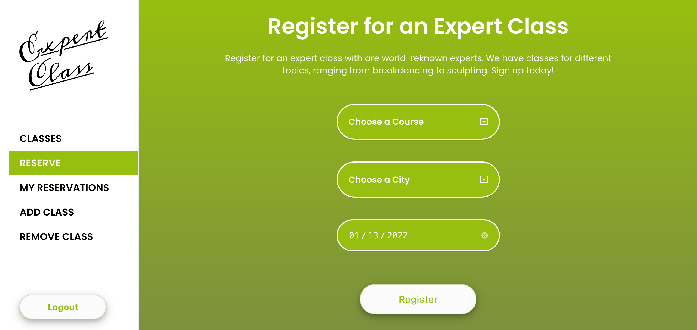
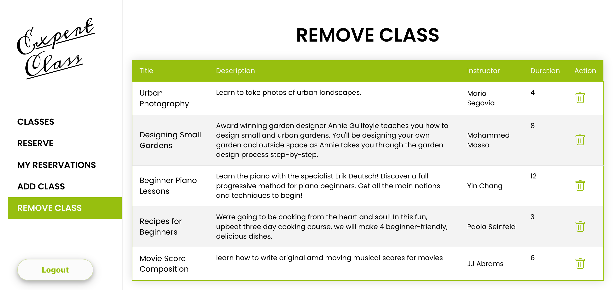
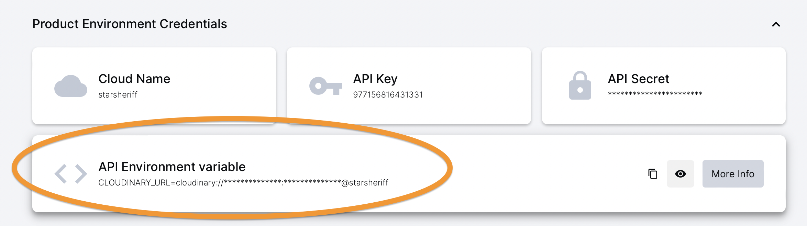
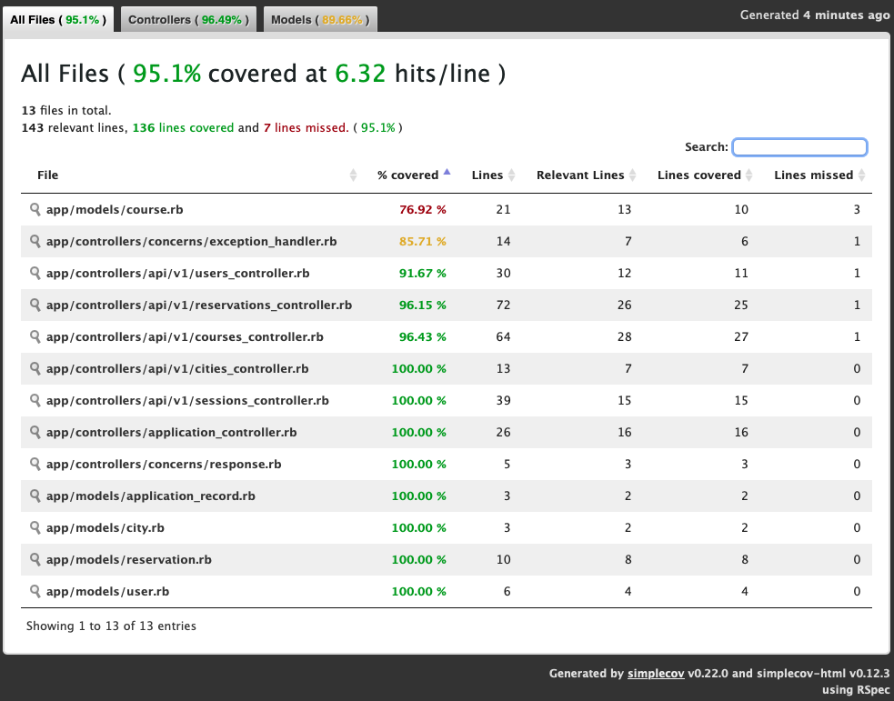

<div align="center">
<h1><a href="https://expert-class-production.up.railway.app/" target="_blank" rel="noopener noreferrer">Expert Class API</a></h1>
</div>

<div align="center">
    
    
    
    
    
    
    
    
    
    
</div>

<br>

<p align="center">This <strong>RESTFUL</strong> API works as the backend for a React web app. The <strong><i>dockerized</i></strong> container of the app is currently hosted on <strong>Railway</strong>. All images are hosted in Cloudinary.</p>

<br>

<div align="center">




</div>

<br>

<!-- omit from toc -->
## Table of Contents
- [About](#about)
  - [API Documentation](#api-documentation)
  - [Features:](#features)
  - [Front-end React app](#front-end-react-app)
  - [Live Demo](#live-demo)
  - [Video Presentation](#video-presentation)
  - [Built With](#built-with)
  - [Project Management](#project-management)
- [Setup and Installation](#setup-and-installation)
    - [Get files](#get-files)
  - [Cloudinary Setup](#cloudinary-setup)
  - [Docker Deploy](#docker-deploy)
    - [Prerequisites](#prerequisites)
    - [Run](#run)
  - [Local deploy](#local-deploy)
    - [Prerequisites](#prerequisites-1)
    - [Install Dependencies](#install-dependencies)
  - [Database Setup](#database-setup)
- [Usage](#usage)
- [Development](#development)
  - [Testing](#testing)
    - [Coverage report](#coverage-report)
  - [Linters](#linters)
- [Authors](#authors)
- [🤝 Contributing](#-contributing)
- [Show your support](#show-your-support)
- [📝 License](#-license)


## About
Expert Class API is the backend for a ***fully responsive*** web app that I built with a team of 4 members. The front end of the app is handled separately by another app. The [repo for the front-end is here](https://github.com/StarSheriff2/expert-class-frontend). The API documentation of this project was generated with the <strong>'rswag'</strong> gem. We built request and integration tests, achieving a 95% coverage. We use cross-site session cookies to handle user authentication. We use PostgreSQL as the database and Cloudinary to store all images in the cloud.

### API Documentation
We used Rswag to generate all the API documentation directly from our tests. You will find all the endpoints necessary to use our API here:
[Documentation](https://expert-class-production.up.railway.app/api-docs)

### Features:
- authenticate user
- create new user
- create and delete a class
- show all classes
- show all reserved classes
- reserve a class

### Front-end React app
- The front-end associated with this app is [here](https://expert-class-frontend-v2.netlify.app).

- The Github repo of the front-end is [here](https://github.com/StarSheriff2/expert-class-frontend).

### Live Demo

Deployed to **Railway**: [Live Demo](https://expert-class-production.up.railway.app/api/v1/healthcheck)

### Video Presentation

Watch a quick demo and walk-through of this project:
<a href="https://www.loom.com/share/bf3cfe3590a9404da7badb3012248a57" target="_blank" rel="noopener noreferrer">
  <p>Expert Class - 13 January 2022 - Watch Video</p>
  
</a>

### Built With
- Ruby 3.0.2p107 (2021-07-07 revision 0db68f0233) \[arm64-darwin20\]
- Rails 6.1.4.1
- PostgreSQL 14
- Cloudinary (for image storing)
- Rspec (testing)
- Faker gem
- Factory bot
- Docker 20.10.22
- Docker compose v2.15.1

### Project Management

We used an agile methodology to manage all the tasks in this project. This project's tasks are described in [this kanban board](https://github.com/StarSheriff2/expert-class/projects/1).

We used GitHub's built-in Kanban board:


## Setup and Installation

To get a local copy up and running, follow these simple example steps.

#### Get files
1. Open your terminal or command prompt.
2. If you do not have git installed in your system, skip this step and go to step 3; otherwise, go to the directory where you want to copy the project files and clone it by copying this text into your command prompt/terminal:
```
  git clone git@github.com:StarSheriff2/expert-class.git
```
  <br>

  *Now go to either the ***"Docker Deploy"*** or the ***"Local Deployt"*** section, depending on how you wish to deploy the API in your system.*

  <br>

3. Download the program files by clicking on the green button that says “**Code**” on the upper right side of the project frame.
4. You will see a dropdown menu. Click on “**Download ZIP**.”
5. Go to the directory where you downloaded the **ZIP file** and open it. Extract its contents to any directory you want in your system.

### Cloudinary Setup
> You will need a Cloudinary account to be able to deploy this app locally or through Docker. If you already have one, look for the **API Environment variable**, which you will find in your cloudinary dashboard:
> - for a Docker deployment, copy the **API Environment variable** into your .env file:

```bash
CLOUDINARY_URL=<your_unique_cloudinary_url>
```
> - for a local deployment, copy the **API Environment variable** into your *config/cloudinary.rb* file, by replacing the text "<cloudinary_url_here>" with the respective value of your **API Environment variable**

> ; otherwise, create a new account by going to Cloudinary and sign up for a free account: [https://cloudinary.com/](https://cloudinary.com/).

Once you have your new Cloudinary account set up, follow these steps:
1. Login with your new account
2. Go to your Cloudinary dashboard
3. Look for the **API Environment variable**
   
4. Do the following:
   - for a local deployment, copy it into your *.env file*, like exaplained above
   - for a Docker deployment, copy it into your *config/cloudinary.rb* file like explained above


### Docker Deploy

#### Prerequisites

- Docker 20.10.22 or latest
- Docker Compose v2.15.1

#### Run

```bash
  docker compose up -d
```

### Local deploy

#### Prerequisites
- Ruby 3.0.2p107
- Rails 6.1.4.1
- PostgreSQL 14
- Cloudinary account and cloudinary_url

#### Install Dependencies
1. If you are not in your system terminal/command prompt already, please open it and go to the directory where you cloned the remote repository or extracted the project files.
2. While in the project root directory, type
    ```
    bundle install
    ```
    This command will install all the necessary gems in your system.

### Database Setup

Run

```bash
bin/rails db:setup
```
This will create your local databases, load the schema, and initialize with the seed data.

**Note:** If you get an error after running this command, it might be because you don't have a database called ***"postgres"***. This happens because when you create a new Rails application, Rails uses this "postgres" database to create and manage the databases for your application. You can easily create one by running this command:
```bash
createdb postgres
```

If Rails still complains about not finding the "postgres" role, you can create one with super-user priviledges:
```bash
createuser -s postgres
```

Now try running the db:setup command again!

You are all set now!
## Usage

1. In your terminal, run
    ```bash
    bin/rails server
    ```
    while inside the root directory of the repository files

    **Note:** _This command will not stop on its own. To exit, hit "ctrl + c"_

2. The app allows API calls using curl or your favorite API client, such as Postman, HTTPPie or VS Code's Thunder Client. Here's a link to [HTTPIE](https://httpie.io).

## Development
### Testing
We created all types of tests for this project:
 - Unit / Model tests
 - Integration tests
 - API request tests

#### Coverage report
  

To run all tests, type this into command line:
```bash
bundle exec rspec
```

### Linters
To run ***Rubocop***, go to the root directory of your repository and copy/paste the following command into your terminal:
```
 rubocop .
```

## Authors
👤 **Arturo Alvarez**
- Github: [@StarSheriff2](https://github.com/StarSheriff2)
- Twitter: [@ArturoAlvarezV](https://twitter.com/ArturoAlvarezV)
- Linkedin: [Arturo Alvarez](https://www.linkedin.com/in/arturoalvarezv/)

👤 **Breno Xavier**

- GitHub: [@brenoxav](https://github.com/brenoxav)
- LinkedIn: [Breno Xavier](https://linkedin.com/in/brenoxav)

👤 **Francis Uloko**

- GitHub: [@francisuloko](https://github.com/francisuloko)
- Twitter: [@francisuloko](https://twitter.com/francisuloko)
- LinkedIn: [Francis Uloko](https://linkedin.com/in/francisuloko)

👤 **Mih Julius**

- GitHub: [@Mihndim2020](https://github.com/Mihndim2020)
- Twitter: [@mihndim](https://github.com/mih-julius)
- LinkedIn: [Mih Julius](https://www.linkedin.com/mih-julius)

## 🤝 Contributing

Contributions, issues, and feature requests are welcome!

Feel free to check the [issues page](https://github.com/StarSheriff2/expert-class/issues).

## Show your support

Give a ⭐️ if you like this project!

## 📝 License

This project is [MIT](https://github.com/StarSheriff2/expert-class/blob/master/LICENSE) licensed.
