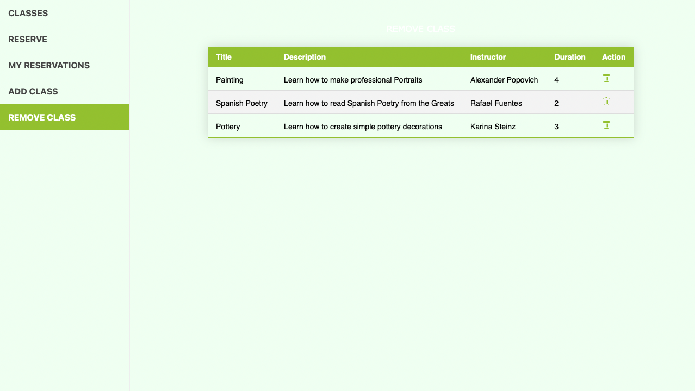
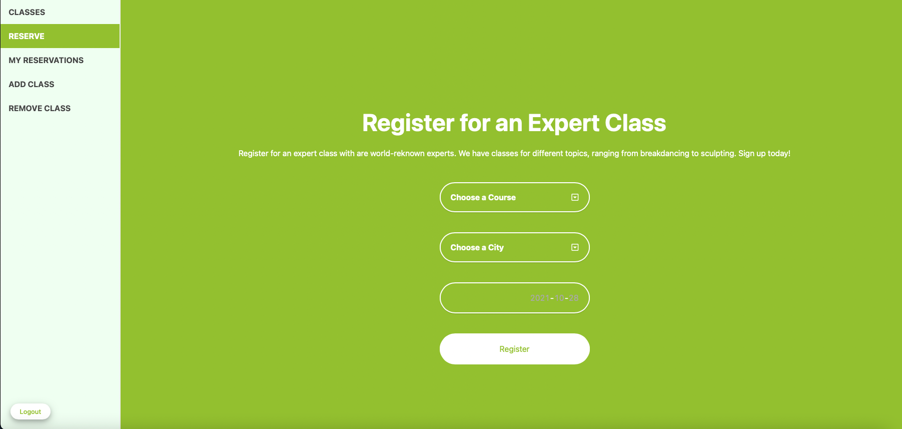

# Expert Class Back-end

> Back-end for Microverse's Final Capstone Project.

## About

This project implements a "Book an Appointment" app following requirements by Microverse. The front-end part follows [this concept design](https://www.behance.net/gallery/26425031/Vespa-Responsive-Redesign) by [Murat Korkmaz](https://www.behance.net/muratk).

This Ruby on Rails, API-only, back-end app is consumed by the React/Redux front-end app from [this repo](https://github.com/brenoxav/expert-class-frontend).

## Built With

- Ruby on Rails

## Kanban Board

This project's tasks are described on [this kanban board](https://github.com/StarSheriff2/expert-class/projects/1).


Number of team members: 4

## Live View

You can access a preview of the back-end API [here](https://expert-class-backend.herokuapp.com).

You can preview the front-end app [here](https://expert-class-frontend.netlify.app).

### Screenshots of the App

<div align="center">



</div>

## Getting Started

To get a local copy up and running, follow these steps.

### Prerequisites

- Terminal / Console / CLI
- [NPM](https://docs.npmjs.com/downloading-and-installing-node-js-and-npm)
- [PostgreSQL](https://www.postgresql.org/download/)
- Web browser

### Setup

1. Download or [clone](https://docs.github.com/en/repositories/creating-and-managing-repositories/cloning-a-repository#cloning-a-repository) the contents from this repository.

2. Go to the project's root directory:
``` bash
cd expert-class
```
3. Install dependencies:
``` bash
bundle install
```

#### Cloudinary Setup
> You will need a Cloudinary account to be able to deploy this app locally. If you already have one, copy your YML file into the config folder; otherwise, create a new account by going to Cloudinary and signing up for a free account: [https://cloudinary.com/](https://cloudinary.com/).

Once you have your new Cloudinary account set up, follow these steps:
1. Login with your new account
2. Go to your Cloudinary dashboard
3. Look for the YML file and click on it to download it
4. Copy this file into your config folder

#### Database Setup

1. Edit the `"database.yml"` file in your `"config"` folder:
    - Change the `username` and `password` under ***`default: &default`*** to your PostgreSQL local credentials or just delete lines 23 and 24 altogether
1. Now, in your terminal, type <code>bin/rails db:create</code> to create your local databases.
2. If successful, type <code>bin/rails db:migrate</code> to migrate the database.
3. Run `rails db:seed`

You are all set now!
### Running locally

1. Start server:

``` bash
rails server
```

2. Go to the endpoint `http://localhost:3001` to access the API.

## Authors

**Arturo Alvarez**

- GitHub: [@StarSheriff2](https://github.com/StarSheriff2)
- Twitter: [@ArturoAlvarezV](https://twitter.com/ArturoAlvarezV)
- LinkedIn: [Arturo Alvarez](https://www.linkedin.com/in/arturoalvarezv/)

**Breno Xavier**

- GitHub: [@brenoxav](https://github.com/brenoxav)
- LinkedIn: [Breno Xavier](https://linkedin.com/in/brenoxav)

**Francis Uloko**

- GitHub: [@francisuloko](https://github.com/francisuloko)
- Twitter: [@francisuloko](https://twitter.com/francisuloko)
- LinkedIn: [Francis Uloko](https://linkedin.com/in/francisuloko)

**Mih Julius**

- GitHub: [@Mihndim2020](https://github.com/Mihndim2020)
- Twitter: [@mihndim](https://github.com/mih-julius)
- LinkedIn: [Mih Julius](https://www.linkedin.com/mih-julius)

## Contributing

Contributions, issues, and feature requests are welcome!

Feel free to check the [issues page](../../issues/).

## Show your support

Give a ⭐️ if you like this project!

## Acknowledgments

- Microverse
- [Murat Korkmaz](https://www.behance.net/muratk) for the concept design of the front-end.
